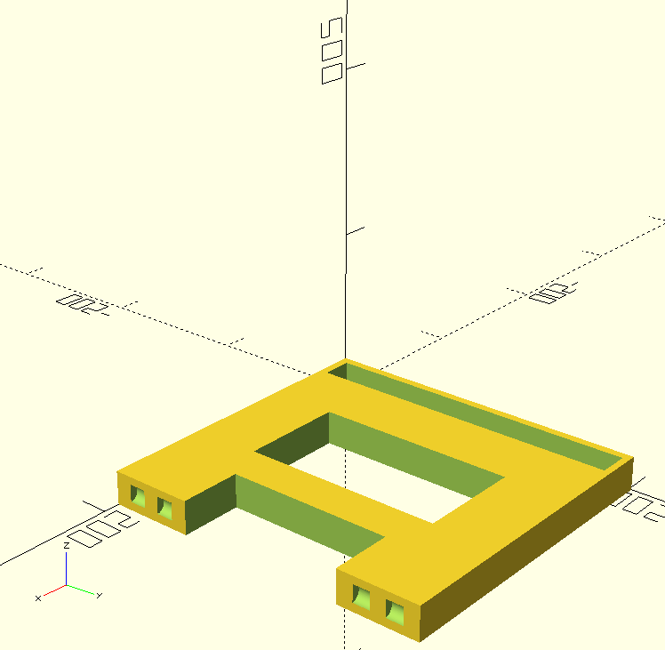
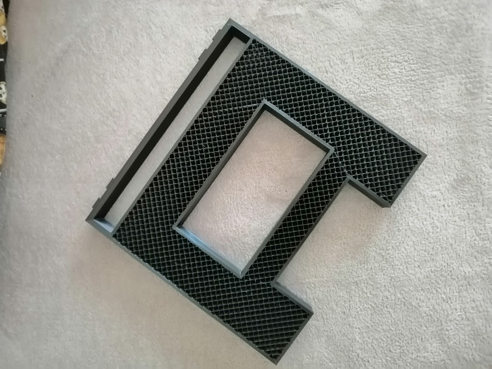
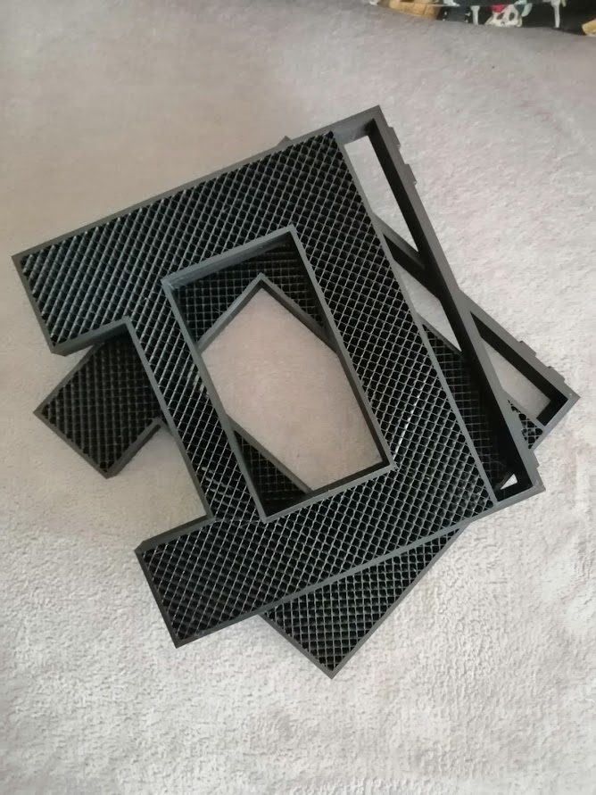
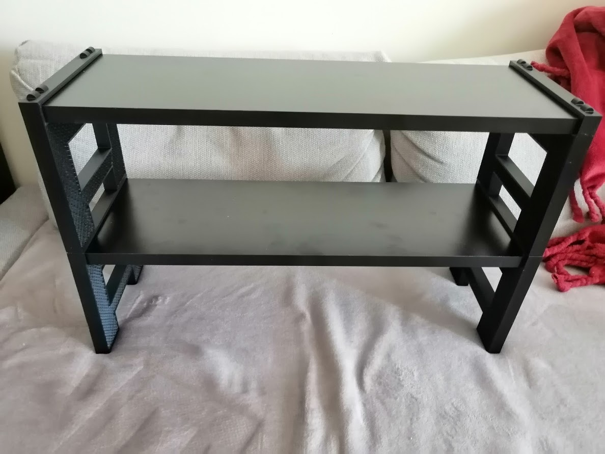

Stackable Shelf Leg - for laminated wood boards 60x19x1.8 cm
============================================================

No screws required, should fit with pressure, can easily be built with 3-4 shelfs without jiggling;

### Overview






### Printing
(pictures printed in Ender3 Pro)
- PLA, PETG or ABS;
- No top or bottom layers;
- 10-15% infill with a nice pattern (as it will be exposed);


### Assembly
- Boards should fit by pressure; if too loose, use some electrical insulation tape on the board so it fits tightly;


### Tweaks

Try to test first the board hole, by commenting the last lines of the file:
```
// uncomment this line
test_shelf_hole();
// comment this line and generate the STL
// body();

``` 

This will allow you to test printer tolerances and adjust the reference constants on top of the file without printing the whole piece

